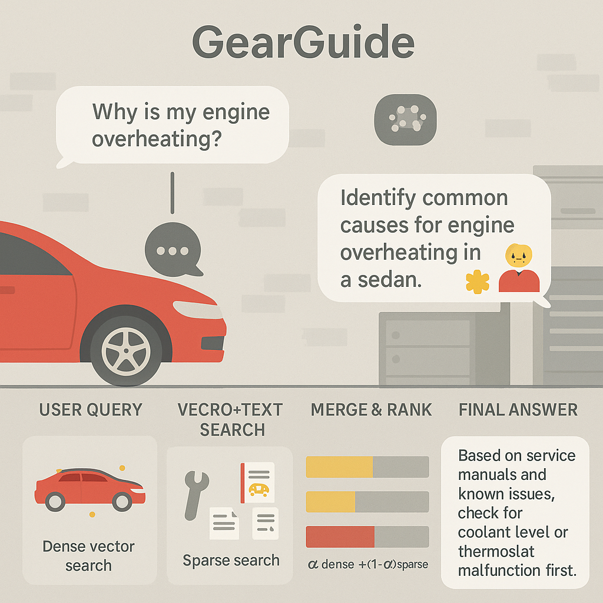
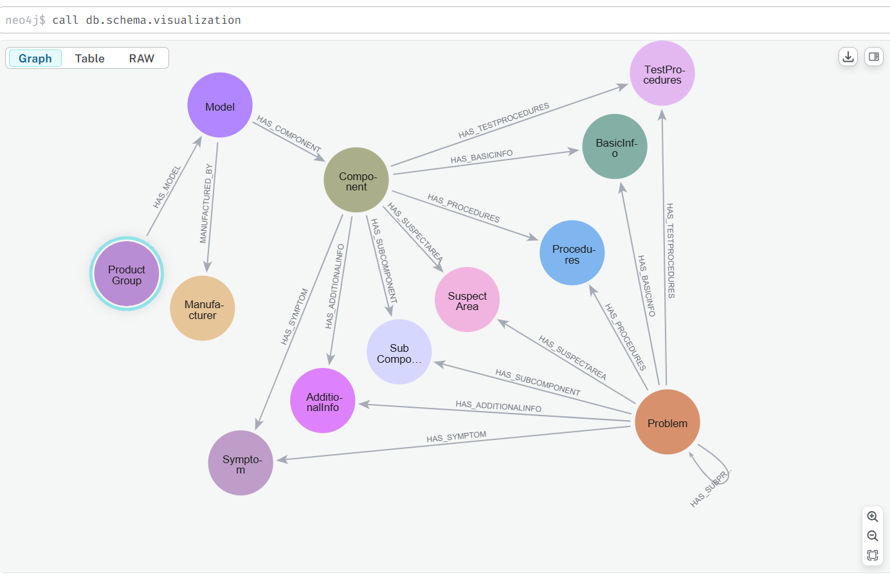

# Gear Guide: A Graph-Powered AI Chatbot for Smarter Troubleshooting 

## The Problem:
 Modern car owners often face technical issues, whether it's "AC not cooling" or "headlights flickering” but traditional troubleshooting tools and chatbots fall short. They struggle with maintaining context, handling ambiguous symptoms, and offering precise repair instructions. The experience is frustrating: repetitive conversations, generic answers, and no memory of what was said just moments ago. 

## The Spark:
 Our idea for **Gear Guide**, an AI-powered RAG (Retrieval-Augmented Generation) chatbot, was born out of this gap. We envisioned a smarter support assistant, one that *understands* vehicle systems, *remembers* user queries, and *guides* them through structured, contextual answers. By blending **OpenAI’s embeddings** with **Neo4j’s graph-based knowledge** and a **hybrid retrieval strategy**, we designed a chatbot that behaves less like a script and more like a *skilled mechanic’s assistant*. 

 

## How It Works: Under the Hood of Gear Guide

Gear Guide combines the best of semantic search and knowledge graphs: 

1. **A Rich, Structured Knowledge Base** 
     We modeled technical car data as a graph in Neo4j, organizing relationships between components, symptoms, procedures, and problems. For example: 

     a. "AC not cooling" connects to symptoms like "low airflow" and tests like "compressor pressure check". 

     b. "Remote key not working" links to "keyless entry malfunction", a common user concern. 

2. **Data Ingestion via LLM**
     Manuals and troubleshooting documents were converted into structured XML using a custom PDF-to-Graph pipeline powered by GPT. Tags like `<symptom>, <procedure>, and <test>` were extracted to feed into the Neo4j graph—no manual curation needed. 

3. **Hybrid Retrieval (Dense + Sparse)**

     a. **Dense Retrieval** uses OpenAI’s embeddings + Neo4j vector index for semantic matches. 

     b. **Sparse Retrieval** uses full-text Lucene search to capture exact keyword hits. 

     c. A **Hybrid Strategy** reranks results using a weighted score `(hybrid_score = α * dense + (1-α) * sparse)`, ensuring the best of both worlds: relevance and accuracy. 

4. **Multi-Turn Conversations**
     Every query goes through rephrasing and context injection, allowing the system to maintain continuity in chat sessions—an often-missing feature in traditional bots. 

5. **Interactive UI**
     The frontend is built with Flask, providing a responsive interface where users can ask natural questions like: 

     a. “Why isn’t my AC working?” 

     b. “How do I replace the bumper on a Yaris?” 

     c. “What could cause dim headlights after engine start?” 

 

## Why It Matters 

**Gear Guide isn’t just a chatbot—it’s a structured AI assistant that thinks in graphs.**

By linking symptoms, problems, and test procedures with real-world semantics, we provide users with a guided diagnostic experience. Our hybrid search approach outperforms both keyword-based and purely semantic systems, delivering answers that are contextually rich and technically grounded. 

 

## Key Impact 

- **Smarter Repairs**: Faster and more accurate troubleshooting for drivers and technicians 

- **Context-Aware AI**: True multi-turn memory and relevance optimization 

- **Hybrid Retrieval**: Combines the power of semantic understanding and exact match precision 

- **Graph-Powered Insights**: Every problem is navigated through connected components and causes 
***

# Full Technical Document



## Schema Overview

###  Node Types

| Node Label        | Description                    |
|-------------------|--------------------------------|
| ProductGroup      | Vehicle categories             |
| Manufacturer      | Car maker (e.g., Toyota)       |
| Model             | Car model (e.g., Yaris)        |
| Component         | Part of the vehicle            |
| Problem           | Issues faced                   |
| Symptom           | Observable signs               |
| Procedures        | Repair/installation steps      |
| BasicInfo         | General car information        |
| SubComponent      | Detailed internal components   |
| AdditionalInfo    | Notes, warnings, extra data    |
| SuspectArea       | Potential faulty regions       |
| TestProcedures    | Diagnostic steps               |

### 🔗 Relationships

| Relationship Name         | Description                            |
|---------------------------|----------------------------------------|
| HAS_MODEL                 | ProductGroup → Model                   |
| MANUFACTURED_BY          | Model → Manufacturer                   |
| HAS_COMPONENT             | Model → Component                      |
| HAS_PROCEDURES            | Component → Procedures                 |
| HAS_SYMPTOM               | Problem → Symptom                      |
| HAS_SUBPROBLEM            | Problem → Sub-problem (hierarchical)   |
| HAS_ADDITIONALINFO        | Component/Problem → AdditionalInfo     |
| HAS_SUSPECTAREA           | Problem → SuspectArea                  |
| HAS_BASICINFO             | Component → BasicInfo                  |
| HAS_SUBCOMPONENT          | Component → SubComponent               |
| HAS_TESTPROCEDURES        | Component → TestProcedures             |

---
## PDF → Structured XML via LLM

### Script: `pdf_extraction.py`
- Extracts raw text from manuals
- Breaks long text into chunks
- Uses GPT to output structured data with tags like:
  ```xml
  <problem>ac not cooling</problem>
  <symptom>weak airflow</symptom>
  <test><name>compressor test</name><procedure>Check pressure</procedure></test>
- Tags are flexible; non-standard tags are stored under <additional_info>


## Data Ingestion Flow

### Script Logic

**Function:** `parse_and_insert_data(xml_content, component_name)`
- Cleans XML from LLM output
- Maps each XML tag to Neo4j label via [`tag_to_label_map`](data/constants.py)
- Creates and links graph nodes using Cypher queries
- Handles nested problems and long lists efficiently
- Uses APOC for conditional logic in Cypher (dynamic merging)

---

## Embedding-Based Dense Retrieval

### Function: `get_openai_embedding`
- **Embedding Model:** `text-embedding-3-small`
- Converts user queries into dense vectors

**Function:** `vector_search(query_vector, node_label, top_k=10, threshold=0.7)`  
- **Vector Index Name:** `vectorIndex_<NodeLabel>`  
- **Cypher Syntax:**
  ```cypher
  CALL db.index.vector.queryNodes($index_name, $top_k, $query_vector)
  ```

---

## Sparse Retrieval

**Function:** `sparse_search(user_query, node_label)`  
Uses full-text search index:

```cypher
CALL db.index.fulltext.queryNodes('search_<Label>', $query) YIELD node, score
RETURN node.name, score
```

---

## Hybrid Retriever

**Function:** `Use ThreadPoolExecutor to parallelize vector and full-text search`  
Combines dense and sparse scores:

```python
hybrid_score = alpha * dense_score + (1 - alpha) * sparse_score
```

- Create `retrieve_data()` to unify both retrieval strategies
- Normalize scores before combining
- Filter by top-k if needed
- Merge and deduplicate results by node name

---

## User Flow Diagram

```text
[User Query]
     ↓
[Rephrasing with LLM (if chat history exists)]
     ↓
[Embedding Generation using OpenAI]
     ↓
┌────────────────────┐       ┌────────────────────┐
│ Dense Search        │     │ Sparse Search       │
│ (Neo4j Vector Index)│     │ (Fulltext Lucene)   │
└──────────┬──────────┘     └──────────┬──────────┘
           ↓                           ↓
     [Hybrid Merge & Rerank Scores (alpha-weighted)]
                       ↓
         [Deduplication & Top-K Selection]
                       ↓
       [Graph Expansion (Related Nodes)]
                       ↓
         [Final LLM Response Generation]


```
## Sample User Queries & Results

| User Query                                | Top Match Node              | Node Type   | Score |
| ----------------------------------------- | --------------------------- | ----------- | ----- |
| "AC not working properly"                 | "ac system not cooling"     | Problem     | 0.89  |
| "Car remote doesn't lock"                 | "keyless entry malfunction" | Problem     | 0.86  |
| "Headlights flickering at night"          | "check headlamp fuse"       | Procedures  | 0.81  |
| "Steering makes noise when turning"       | "steering fluid low"        | Symptom     | 0.83  |
| "What's the cause of engine overheating?" | "radiator coolant leak"     | SuspectArea | 0.84  |

---

##  Visual Graph Snapshot – Example Traversal Path

###  Query: "AC not cooling"

**Traversal Path (Graph View):**
```
(:Component {name: "air conditioning"}) 
   └──[:HAS_PROBLEM]──> (:Problem {name: "ac not cooling"})
       └──[:HAS_SYMPTOM]──> (:Symptom {name: "low airflow"})
       └──[:HAS_PROCEDURES]──> (:Procedures {name: "check compressor pressure"})
```



---

##  Comparative Outcomes – Dense vs Sparse vs Hybrid

### Query: "Remote key not working"

| Retrieval Mode | Top Match                      | Type    | Score | Notes                              |
| -------------- | ------------------------------ | ------- | ----- | ---------------------------------- |
| **Sparse**     | "key" → "lock" → "battery"     | Problem | 0.65  | Keyword match, misses context      |
| **Dense**      | "keyless entry not responding" | Problem | 0.86  | Captures intent, loses exact token |
| **Hybrid**     | "keyless entry malfunction"    | Problem | 0.92  | Best of both, exact + semantic     |

> **Conclusion:** Hybrid retrieval improved both relevance and clarity. It correctly inferred "remote key" refers to "keyless entry".

---

## Real-World Query Examples (for Demo/Docs)

| Query                                | Expected Top Match          | Node Type   | Why it's relatable         |
| ------------------------------------ | --------------------------- | ----------- | -------------------------- |
| "AC not working"                     | "ac system not cooling"     | Problem     | Common summer issue        |
| "Car won’t lock with remote"         | "keyless entry malfunction" | Problem     | Frequent user complaint    |
| "Headlights dim after engine starts" | "battery voltage drop"      | Symptom     | Electrical fault diagnosis |
| "Steering hard to turn"              | "low power steering fluid"  | SuspectArea | Linked to hydraulic issue  |
| "How to remove bumper?"              | "bumper removal procedure"  | Procedures  | Practical DIY fix          |

 **Tip:** Capture real user-like phrasing to test the robustness of your retrieval system.

---
## Environment Configuration

| Key                             | Purpose                                        |
| --------------------------------| ---------------------------------------------- |
| `NEO4J_URI`                     | Neo4j DB connection URI                        |
| `NEO4J_USERNAME`                | Neo4j DB Username                              |
| `NEO4J_PASSWORD`                | Neo4j DB Password                              |
| `OPENAI_API_KEY`                | LLM + Embedding access                         |
| `EMBEDDING_MODEL`               | OpenAI model (default: text-embedding-3-small) |
| `model`                         | Chat model (default: gpt-4o)                   |
| `alpha`                         | Weight for hybrid scoring                      |
| `top_k`                         | Result cutoff                                  |
| `threshold`                     | Similarity threshold                           |
| `SECRET_KEY`                    | Secret key for the sql database                |
| `SQLALCHEMY_DATABASE_URI`       | Database connection server                     |


## Function Reference

| Function Name                | Description                             |
| ---------------------------- | --------------------------------------- |
| `extract_pdf_content`        | Read PDF into plain text                |
| `structure_content_with_llm` | Generate structured XML tags            |
| `parse_and_insert_data`      | Create nodes and relationships in Neo4j |
| `get_openai_embedding`       | Generate dense vector from text         |
| `vector_search`              | Perform ANN vector search               |
| `fulltext_search`            | Run Lucene query on text fields         |
| `hybrid_search`              | Merge dense + sparse results            |
| `process_top_nodes`          | Expand retrieved node context           |
| `final_call`                 | Generate final LLM response             |
| `rag_advisor`                | Full pipeline: input → answer           |

## Future Vision
Gear Guide began as a proof-of-concept for smarter troubleshooting using RAG and graph-based reasoning, but its potential goes far beyond automotive diagnostics. 
<br>
Here's where we see it heading: 

1. **Multi-Domain Diagnostic Assistant**

     Extend beyond vehicles into other verticals where structured troubleshooting is critical: 

     a. **Consumer electronics** (e.g., phone won't charge → battery port → test cable → reset) 

     b. **Medical equipment** diagnostics for technicians 

     c. **Smart home systems** (e.g., thermostat issues, smart lock malfunctions) 

2. **Continual Knowledge Ingestion**

     Automate ingestion of new manuals, guides, and repair logs in real-time using: 

     - Fine-tuned LLMs for multi-lingual manuals 

     - Auto-tagging pipelines with confidence thresholds 

     - Crowdsourced updates from technician feedback 

3. **Voice-Enabled Mobile Companion**

     Build a mobile app where users can: 

     - Speak their car issues out loud ("my engine's rattling at startup") 

     - Get step-by-step procedures 

     - Use AR overlays (e.g., guide you to open the hood, check the dipstick) 

4. **Closed-Loop Learning System**

     - Track which troubleshooting paths led to successful resolutions 

     - Reinforce the knowledge graph based on real-world usage 

     - Use reinforcement learning or fine-tuning to improve LLM grounding 

5. **B2B Integration with Repair Shops**

     Partner with: 

     - Automotive repair shops for technician-facing AI tools 

     - Manufacturers for embedding Gear Guide in **owner apps**, **onboard systems**, or **support portals**.


### Contributors:

[Anusha Umashankar](https://github.com/Anusha-raju) 
[LinkedIn](http://www.linkedin.com/in/anusha-umashankar) | Email: anusha.u.raju@gmail.com

[Dinesh Karnati](https://github.com/DineshKarnati)
[LinkedIn](https://www.linkedin.com/in/%20dineshkarnati8099) | Email: dineshkarnati510@gmail.com
